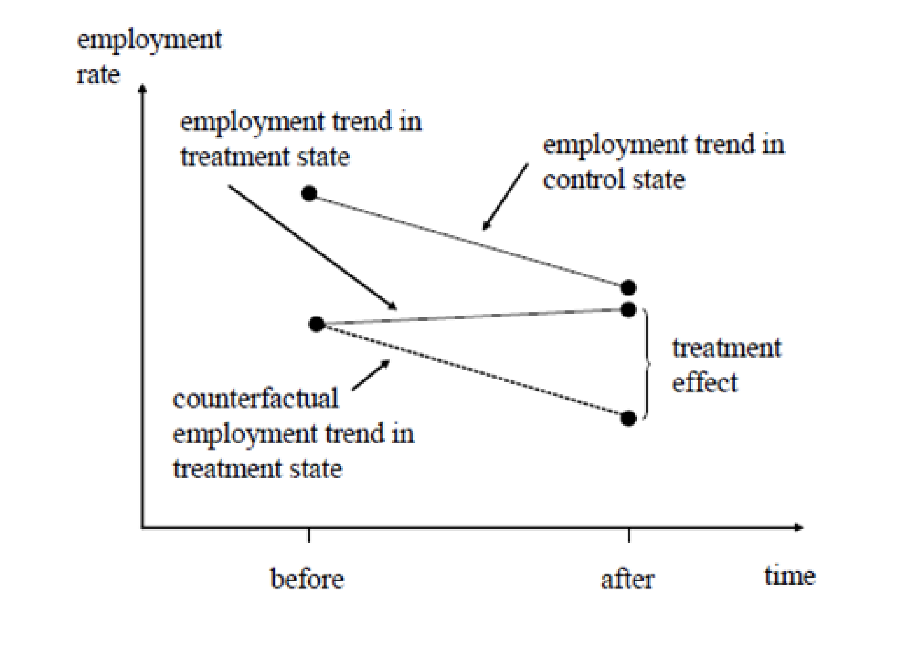
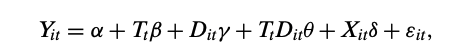
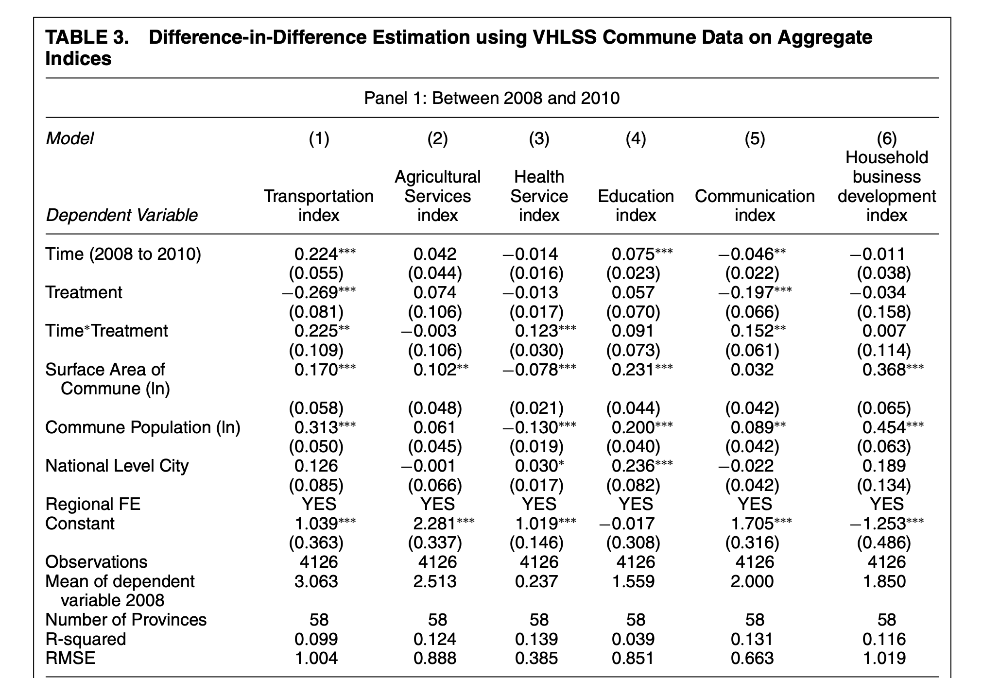

## Working on two datasets  

### Merge

Useful functions merging datasets from `dplyr` include `left_join`, `right_join`, `full_join`, `inner_join`.

Suppose we have two datasets `x` and `y`.

`inner_join(x, y, by = ...)`
return all rows from x where there are matching values in y, and all columns from x and y. If there are multiple matches between x and y, all combination of the matches are returned.

`left_join(x, y, by = ...)`
return all rows from x, and all columns from x and y. Rows in x with no match in y will have NA values in the new columns. If there are multiple matches between x and y, all combinations of the matches are returned.

`right_join(x, y, by = ...)`
return all rows from y, and all columns from x and y. Rows in y with no match in x will have NA values in the new columns. If there are multiple matches between x and y, all combinations of the matches are returned.

`full_join(x, y, by = ...)`
return all rows and all columns from both x and y. Where there are not matching values, returns NA for the one missing.


```{r,include=FALSE}
# attach the packages
library(tidyverse)
library(xtable)
library(stargazer)
library(wooldridge)
library(readr)
library(haven)
library(lfe)
```

```{r}
data("band_members")
data("band_instruments")
data("band_instruments2")
# band members of the Beatles
band_members

# band instruments of Beatles
band_instruments

# "Mutating" joins combine variables from the LHS and RHS
band_members %>% inner_join(band_instruments, by = "name")

band_members %>% left_join(band_instruments, by = "name")

band_members %>% right_join(band_instruments, by = "name")

band_members %>% full_join(band_instruments2, by = c("name" = "artist"))
```

### Append

```{r}
beatles <- band_members %>% filter(band == "Beatles")
stones <- band_members %>% filter(band == "Stones")

bind_rows(beatles, stones)
```

\clearpage

## Difference-in-Differences Bascis

### Implementation of DID

Two differences:

 -  difference in the means of the treatment before and after the treatment
 
 -  difference in the means of the control before and after the treatment

Let us denote four averages of the response, as follows:

- $\hat y_{T,A}$  Treatment, After
- $\hat y_{C,A}$   Control, After
- $\hat y_{T,B}$  Treatment, Before
- $\hat y_{C,B}$   Control, Before

The difference-in-differences estimator $\hat \delta$  is defined as

$$
\hat{\delta}= (\bar{y}_{T,\,A}-\bar{y}_{T,\,B})-(\bar{y}_{C,\,A}-\bar{y}_{C,\,B})
$$


### Card and Krueger (1994)

Card & Krueger (1994) use geography as the “as if” random treatment assignment to study the effect on employment in fast food restaurants caused by an increase in the state minimum wage in New Jersey in the year of 1992.

```{r echo=FALSE, fig.align='center', fig.cap='', out.width='70%'}
knitr::include_graphics('card1994.png')
```

$$
\hat{\delta}  = (\bar{y}_{T,\,A}-\bar{y}_{T,\,B})-(\bar{y}_{C,\,A}-\bar{y}_{C,\,B}) 
             = \Delta \bar{y}_{T} - \Delta \bar{y}_{C} \\
            \approx  (21.03 - 20.44) - (21.17- 23.33)  \\
            \approx 2.75
$$


```{r}
# load data
dat = read_dta("~/PS630-R-Lab/lab-9/njmin3.dta") 

# 2*2 DID table
did = dat %>% 
 group_by(nj,d) %>% 
 summarise( mean = mean(fte, na.rm = T)) 
did
# did estimate

 (did[4,3] -  did[3,3]) - (did[2,3] -  did[1,3])
```

\clearpage 

### Dif-in-Dif Visualization

```{r echo=FALSE, out.width='70%', fig.align='center', fig.cap=''}
# From Mostly Harmless Econometrics by Joshua Angrist and 

```

\clearpage 
### Dif-in-Dif Regression

 - Difference-in-differences estimator can be obtained  by running a regression that includes indicator variables for treatment and after and their interaction term. 
 
 - Advantage of a regression over manual calculation is that  regression allows taking into account other factors that might influence the treatment effect
 
 - Simplest difference-in-differences regression model is presented as follows, where  $y_{it}$  is the response for unit  $i$  in period  $t$ . In the typical difference-in-differences model there are only two periods, before and after

$$
y_{it}=\beta_{1}+\beta_{2}A+\beta_{3}T+\delta A \times T+e_{it}
$$

Show $\delta$ is the Dif-in-Dif estimator
$$
E(y_{it}|T= 1, A = 1) - E(y_{it}|T= 1, A = 0) = (\beta_1+ \beta_2 + \beta_3 + \delta ) - (\beta_1 + \beta_3 ) = \beta_2 + \delta  
$$

$$
E(y_{it}|T= 0, A = 1) - E(y_{it}|T= 0, A = 0) = (\beta_1+ \beta_2) - \beta_1 = \beta_2
$$

$$
[E(y_{it}|T= 1, A = 1) - E(y_{it}|T= 1, A = 0) ] - [E(y_{it}|T= 0, A = 1) - E(y_{it}|T= 0, A = 0)] \\ = (\beta_2 + \delta ) - \beta_2  \\=   \delta
$$

```{r}
mod1 <- lm(fte~nj*d, data=dat)
mod2 <- lm(fte~nj*d+
             kfc+roys+wendys+co_owned, data=dat)
mod3 <- lm(fte~nj*d+
             kfc+roys+wendys+co_owned+
             southj+centralj+pa1, data=dat)
```

```{r,results= "asis"}
stargazer(mod1,mod2,mod3, 
          header = F,
          type = "html",
          title="Difference in Differences example"
          )
```

## A gernalized case: Malesky, Nguyen, Tran (2014)

They analyze how the removal of local councils will affect public service delivery in Vietnam using the following regression.

```{r echo=FALSE, out.width='70%', fig.align='center', fig.cap=''}
# From Mostly Harmless Econometrics by Joshua Angrist and 

```

```{r echo=FALSE, out.width='70%', fig.align='center', fig.cap=''}
# From Mostly Harmless Econometrics by Joshua Angrist and 

```

```{r}
# load data
recen <- read_dta("~/PS630-R-Lab/lab-9/recen_apsr_main.dta")

m1 = felm(index1 ~  time + treatment + time_treatment + lnarea + lnpopden + city | reg8-1 |0| tinh + huyen, recen, psdef=FALSE )

m2 = felm(index2 ~  time + treatment + time_treatment + lnarea + lnpopden + city | reg8-1 |0| tinh + huyen, recen , psdef=FALSE)

m3 = felm(index3 ~  time + treatment + time_treatment + lnarea + lnpopden + city | reg8-1 |0| tinh + huyen, recen , psdef=FALSE)
```

```{r, results="asis"}
stargazer(m1,m2,m3, header = FALSE,
          title = "Table3. Panel 2: Between 2008 and 2010", type = "html")
```

### Parallel trends assumption

- Parallel trends assumption is crucial
- If no program, outcomes of treatment & control would have moved in tandem
- If outcome trends differ, estimate is biased i.e. If control is growing faster, we will underestimate impact
- Assumption impossible to prove definitively
- Can use placebo test to assess validity of assumption

### How to show evidence that is consistent with parallel trends assumption

"We test this assumption by running diff-in-diff regressions using commune data from the 2006 and 2008 VHLSSs. The two surveys were conducted before the intervention in 2009, and therefore we should expect that the effect of the
interaction between the time and treatment variables
should not be statistically significant."

```{r echo=FALSE, out.width='70%', fig.align='center', fig.cap=''}
# From Mostly Harmless Econometrics by Joshua Angrist and 
knitr::include_graphics('./agg_placebo.png')
```

```{r}
recen0608 <- read_dta("~/PS630-R-Lab/lab-9/recen_apsr_pre.dta")

m1 = felm(index1 ~  time + treatment + time_treatment + lnarea + lnpopden + city | reg8 |0| tinh + huyen , recen0608, psdef=FALSE )

m2 = felm(index2 ~  time + treatment + time_treatment + lnarea + lnpopden + city | reg8 |0| tinh + huyen, recen0608, psdef=FALSE )

m3 = felm(index3 ~  time + treatment + time_treatment + lnarea + lnpopden + city | reg8 |0| tinh + huyen , recen0608, psdef=FALSE )

```


```{r, results="asis"}
stargazer(m1,m2,m3, header = FALSE, title = "Table3. Panel 2: Between 2006 and 2008", type = "html")
```

You can find the article here:

https://sites.duke.edu/malesky/files/2014/07/TheImpactofRecentralization.pdf

## Dif-in-Dif Robustness Test Checklist

- Pre-treatment trends in the outcome:
  - Check if the trends are parallel in the pre-treatment periods
  - Requires data on multiple pre-treatment periods (the more the better)
  - Note this is only diagnostics, not a direct test of the assumption!
- Placebo test using previous periods:
   - Suppose DD with time periods t1, t2, t3, where treatment occurs in t3
   - Exclude data from t3, assign t2 as “placebo" treatment period, and
   - re-estimate DD
- Placebo test using alternative groups:
     - Re-code some control groups as treated
     - Re-estimate DD with the placebo-treated units & without actual treated units
- Placebo outcomes:
   - Find outcomes that, theoretically, should be unaffected by the treatment, but might
   - Re-estimate DD on these outcomes


